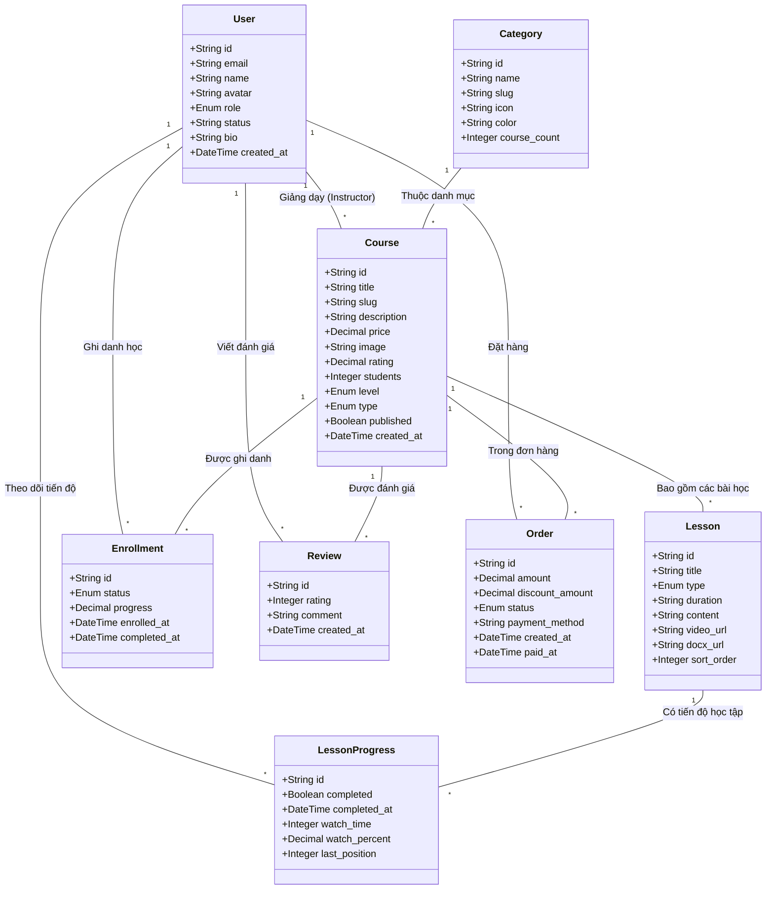

# Sơ đồ lớp (Class Diagram) - Hệ thống EDULearn

Tài liệu này mô tả cấu trúc các lớp và mối quan hệ giữa chúng trong hệ thống EDULearn, tập trung vào việc quản lý khóa học, ghi danh và theo dõi tiến độ học tập.

## 1. Biểu đồ Mermaid

## 2. Giải thích chi tiết các quan hệ chính

### 2.1. Quan hệ Ghi danh (Enrollment)
Đây là quan hệ **Nhiều - Nhiều** giữa `User` (Học viên) và `Course` (Khóa học), được cụ thể hóa qua lớp trung gian `Enrollment`.
*   Mỗi bản ghi `Enrollment` thể hiện việc một học viên đã đăng ký một khóa học.
*   Trường `status` lưu trạng thái (Đang học, Hoàn thành, Tạm dừng).
*   Trường `progress` (0-100%) thể hiện tổng tiến độ hoàn thành khóa học của học viên đó.

### 2.2. Quan hệ Tiến độ bài học (Lesson Progress)
Đây là quan hệ chi tiết hơn để theo dõi việc học của từng bài giảng, là quan hệ **Nhiều - Nhiều** giữa `User` và `Lesson`.
*   Giúp hệ thống biết học viên đã xem bài giảng đến đâu (`last_position`), xem được bao nhiêu phần trăm (`watch_percent`).
*   Khi tất cả `LessonProgress` của các bài học trong một khóa học được đánh dấu `completed = true`, hệ thống sẽ cập nhật `Enrollment.status = 'COMPLETED'`.

### 2.3. Quan hệ Giảng viên (Instructor)
*   Một `User` có vai trò `INSTRUCTOR` có thể tạo và quản lý nhiều `Course`. Đây là quan hệ **1 - Nhiều**.

### 2.4. Quan hệ Danh mục (Category)
*   Các khóa học được phân loại theo `Category` để người dùng dễ dàng tìm kiếm. Một danh mục có thể chứa nhiều khóa học (**1 - Nhiều**).
